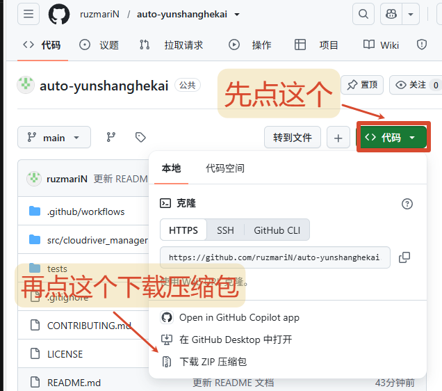

# 纯小白教程

这篇教程面向不熟悉 Python、Git 和命令行的用户。按照顺序操作即可，只需会用电脑，不需要额外基础。


## 一、你需要准备

- 一台可以正常联网的 Windows 10 或 Windows 11 电脑。
- 一个正常可登录的云上河开账号。
- 一个普通浏览器，建议使用 Chrome 或 Edge。
- Python 3.11 或更高版本。

## 二、安装 Python
1. 打开 [Python 官方下载页面](https://www.python.org/downloads/)。
2. 下载 Python 3.11 或更高版本的 Windows 安装程序。
3. 打开安装程序。
4. **务必勾选窗口底部的 `Add Python to PATH`**。
5. 点击 `Install Now`，等待安装完成。
6. 安装完成后关闭安装窗口。

如果之前已经安装过符合要求的 Python，可以跳过这一节。

## 三、下载项目

### 方法 A：下载 ZIP（最简单，推荐）


1. 打开本项目的 GitHub 页面。
2. 点击绿色的 `Code` 按钮。
3. 点击 `Download ZIP`。
4. 下载完成后右键 ZIP 文件，选择“全部解压”。
5. 将解压后的文件夹放到容易找到的位置，哪都行。

这种方式最简单，但菜单中的自动更新功能无法使用。以后更新时，需要重新下载新版 ZIP。

### 方法 B：使用 Git（支持菜单自动更新）

先安装 [Git for Windows](https://git-scm.com/download/win)，然后在准备存放项目的文件夹中打开 PowerShell，运行：

```powershell
git clone 你的项目仓库地址
cd auto-yunshanghekai
```

通过 `git clone` 下载的项目可以使用菜单中的“检测更新”。

## 四、第一次启动

1. 打开项目文件夹。
2. 双击 `start.cmd`。
3. 期间可能出现一些Windows系统或安全软件的二次确认，允许运行即可。
4. 首次启动时，程序会自动进行三步准备：
   - 创建项目专用运行环境 `.venv`；
   - 安装运行依赖和登录组件；
   - 进入程序菜单。
5. 首次安装可能需要几分钟。窗口暂时没有变化不代表卡死，请不要反复关闭。

这些文件只会安装到项目目录内，不会替换系统 Python，也不会修改你的日常浏览器配置。为避免英文安装日志刷屏，详细记录会保存在项目目录的 `.bootstrap-install.log` 中；只有安装失败时，程序才会显示末尾的错误信息供排查。

以后再启动时，直接双击 `start.cmd` 即可，通常不会重复安装。

## 五、首次登录

1. 程序发现没有登录记录时，会询问是否立即登录。
2. 直接选择确认，会自动调用浏览器弹出云上河开登陆界面。
3. 在弹出的浏览器窗口中登录你的云上河开账户，密码/扫码/短信登录都可以，没区别。
4. 登录成功后，浏览器窗口会被自动关闭，如果没有就手动关闭浏览器，然后回到命令提示符。
5. 程序会保存临时会话，并显示当前登录账户信息，登录信息长期有效，不需要每次使用都登录。

程序不会保存你的明文密码，而是把登录凭据储存到 `.cloudriver/session.json` ，永远不要把这个文件发给别人。

如果没有自动打开浏览器，请确认电脑已安装最新版 Chrome 或 Edge，然后在菜单中选择“登录/刷新”重试。

## 六、菜单怎么用

### 1. 课程状态

从服务器重新获取课程和任务列表，显示每项任务的序号、服务器认可的进度以及完成状态。

### 2. 开始学习

- **直接开始**：从列表中第一个未完成任务开始。
- **指定序号**：程序先显示课程列表，再让你输入起始序号；它会从该位置向后查找，并自动跳过已完成任务。

学习过程中程序会显示进度条，完成一项后再次向服务器确认，然后切换到下一项。

要手动停止，先回到命令窗口，然后按 `Ctrl+C`。已经完成的进度不会丢，下次再进入任务时会自动恢复。

### 3. 登录/刷新

用于首次登录、会话过期后重新登录，或者切换账号用，平常不用管它。

### 4. 登录状态

检查当前会话是否仍然有效，并显示服务器能够返回的姓名、学号/用户名、用户 ID 等信息。

### 5. 功能说明

在程序内查看各菜单功能的详细解释。

### 6. 初始化配置

生成或整理 `.cloudriver/config.json`。该文件保存 heartbeat 间隔、请求超时和网络重试等程序设置。一般用户保持默认值即可；这个操作不会删除登录状态或服务器学习进度。

### 7. 检测更新

手动检查 GitHub 是否有新版。只有通过 `git clone` 下载，并且用户明确同意后，程序才会更新。ZIP 下载方式不能使用此功能。

### 0. 退出程序

正常关闭菜单程序。如果学习正在运行，应先按 `Ctrl+C` 中止。

## 七、再次启动和断点续跑

以后使用时：

1. 双击 `start.cmd`。
2. 先选择“课程状态”，确认服务器进度。
3. 再选择“开始学习”。

程序会跳过服务器已经确认完成的任务。网络中断或程序关闭后，重新启动即可；本地断点仅用于寻找恢复位置，完成状态始终以服务器为准。

## 八、如何更新

### 使用 Git 下载的用户

在主菜单选择“检测更新”。发现新版后，阅读提示并确认更新即可。

也可以在项目文件夹中打开 PowerShell，手动运行：

```powershell
git pull --ff-only
```

更新完成后重新双击 `start.cmd`。

### 使用 ZIP 下载的用户

重新从 GitHub 下载最新版 ZIP 并解压。为了保留登录会话和配置，可以在关闭程序后，将旧目录中的 `.cloudriver` 文件夹复制到新目录。该文件夹包含敏感会话信息，不要分享给别人。

## 九、常见问题

### 双击 `start.cmd` 后提示找不到 Python

通常是没有安装 Python，或者安装时没有勾选 `Add Python to PATH`。重新运行 Python 安装程序并启用 PATH，然后重启电脑再试。

### 第一次安装长时间没有完成

首次运行需要从网络下载依赖。请保持网络连接，耐心等待几分钟。如果明确报错，可以关闭窗口、检查网络后重新运行 `start.cmd`；脚本会继续准备，不需要手动删除已下载文件。

### 出现很多英文是不是中毒了

首次安装时，Python 的包管理器可能输出依赖名称和下载状态，这是正常现象。新版启动脚本已经隐藏大部分非必要日志，并在每一步前显示中文说明；真正发生错误时仍会保留错误信息，方便排查。

### 平台显示 OFFLINE

在菜单中选择“登录/刷新”，重新完成网页登录。如果仍然 OFFLINE，请先确认官方网站本身可以正常登录。

### 网页提示“检测到您有多开终端”

平台限制同时存在多个活跃学习任务。关闭其他正在播放课程的网页或程序，只保留一个学习窗口。本项目默认使用单任务串行模式。

### 怎样完全删除程序

先退出程序，然后删除整个项目文件夹即可。程序的运行环境、配置和会话默认都保存在项目目录中。删除前如需保留设置，可单独备份 `.cloudriver`，但不要将它公开。

